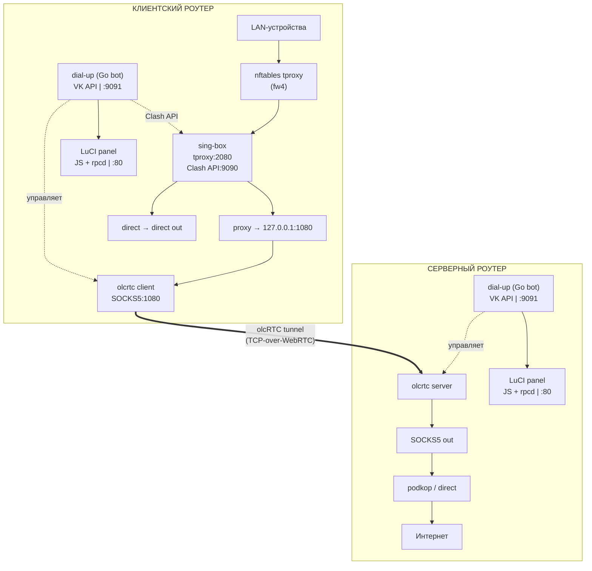
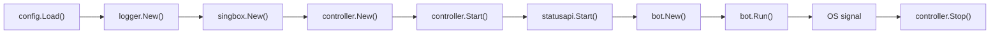
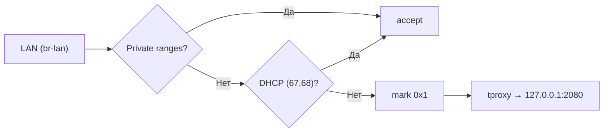
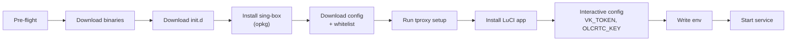
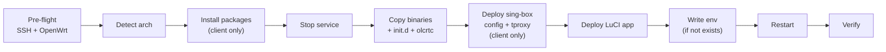
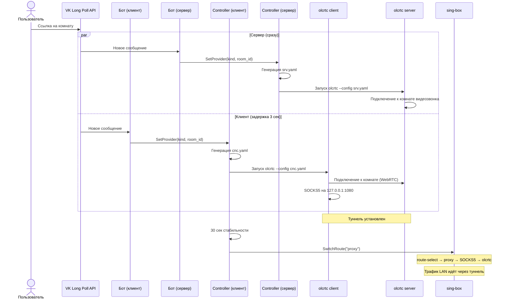
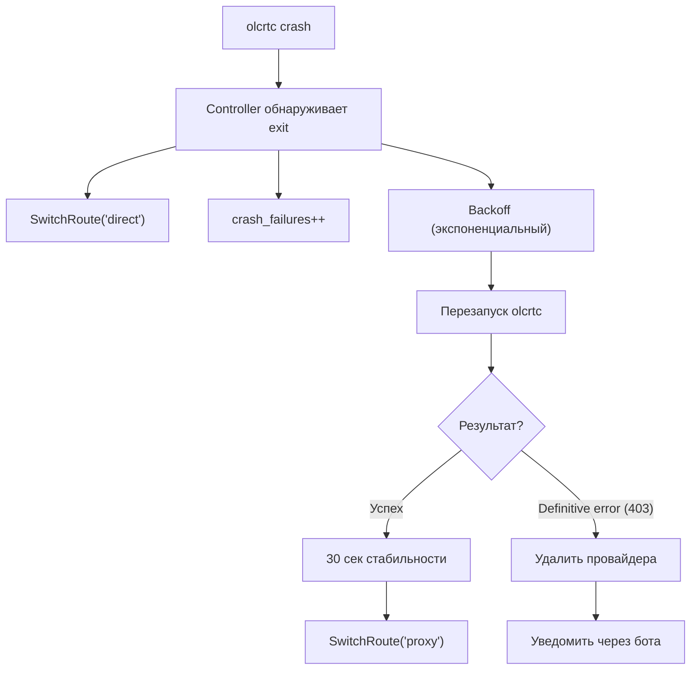
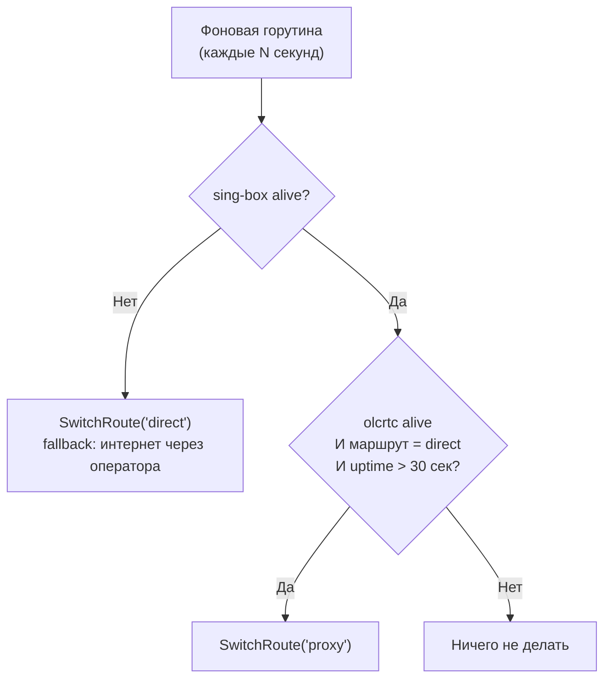

# Архитектура dial-up!

## Обзор системы

dial-up! --- это e2e-решение для построения зашифрованного туннеля между двумя OpenWrt-роутерами через WebRTC-видеозвонок. Система состоит из Go-бэкенда, shell-скриптов автоматизации, LuCI веб-интерфейса и интеграции со сторонними компонентами (olcRTC, sing-box, VK API).



---

## Структура проекта

```
dial-up/
├── main.go                          # Точка входа
├── go.mod                           # Go 1.26, vksdk, env, mage
├── Makefile                         # build, deploy, remove, test, lint
├── deploy.sh                        # SSH-деплой на роутер
├── remove.sh                        # SSH-удаление с роутера
├── install.sh                       # Автономная установка на роутере
│
├── internal/
│   ├── config/                      # Загрузка env-переменных
│   ├── controller/                  # Управление процессом olcrtc
│   ├── bot/                         # VK-бот (long-poll, команды, клавиатура)
│   ├── singbox/                     # Интеграция с Clash API sing-box
│   ├── statusapi/                   # HTTP-эндпоинт статуса (loopback)
│   └── domain/
│       └── logger/                  # Структурированное логирование (slog)
│
├── deploy/openwrt/
│   ├── init.d/dial-up               # procd init-скрипт
│   ├── dial-up.env.sample           # Шаблон конфигурации
│   ├── setup-singbox-tproxy.sh      # Настройка tproxy (UCI + nft + fw4)
│   ├── sing-box-config.json         # Конфигурация sing-box
│   └── whitelist.json               # Whitelist доменов (direct access)
│
├── luci-app-olcrtc/
│   ├── htdocs/.../view/olcrtc/
│   │   ├── control.js               # Вкладка Bot: роль, токен, настройки
│   │   ├── data.js                  # Вкладка Tunnel: ключ, провайдер, SOCKS5
│   │   ├── network.js               # Вкладка Network: маршрутизатор
│   │   ├── network_client.js        # Подвкладка: tproxy, sing-box, whitelist
│   │   ├── network_server.js        # Подвкладка: upstream SOCKS5
│   │   ├── statusbar.js             # Общий компонент: статусбар
│   │   └── logs.js                  # Вкладка Logs: мультиисточник
│   ├── root/usr/libexec/rpcd/
│   │   └── olcrtc-bot               # rpcd-бэкенд (15 ubus-методов)
│   └── root/usr/share/
│       ├── luci/menu.d/...json      # Регистрация меню
│       └── rpcd/acl.d/...json       # ACL-правила
│
├── bin/                             # Скомпилированные бинарники (arm64)
└── tests/                           # Тесты
```

---

## Компоненты

### 1. Go-бэкенд (`main.go` + `internal/`)

#### Точка входа (`main.go`)

Оркестрирует запуск всех компонентов:



При старте создаёт рабочую директорию (`DATA_DIR`, по умолчанию `data/`) и делает `chdir`, чтобы файлы olcrtc (`cnc.yaml`, `srv.yaml`, `last_provider.json`) не засоряли корневую FS.

#### Config (`internal/config/`)

Загружает переменные из окружения (`/etc/dial-up.env` → procd → env). Обязательные поля: `VK_TOKEN`, `OLCRTC_KEY`. Валидация `SOCKS_PROXY_PORT` (1–65535). Защита от placeholder-значений в токене.

```go
type Config struct {
    VKToken, OlcrtcKey     string   // обязательные
    IsClient               bool     // true=клиент, false=сервер
    SocksProxyAddr/Port    string   // upstream SOCKS5 (только сервер)
    StatusPort             string   // HTTP-статус (default: 9091)
    // ... остальные поля
}
```

#### Controller (`internal/controller/`)

Центральный компонент --- управляет жизненным циклом процесса olcrtc:

- **Запуск/остановка olcrtc** как subprocess с корректным YAML-конфигом
- **Crash recovery**: автоматический перезапуск с экспоненциальным backoff
- **Счётчики сбоев**: `failures` (все), `crash_failures` (неожиданные)
- **Provider management**: сохранение/удаление последнего провайдера (`last_provider.json`)
- **Definitive vs transient errors**: при ошибке авторизации (403) провайдер удаляется немедленно
- **tproxy guardian** (только клиент): мониторит доступность sing-box и переключает маршрут при сбое
- **Стабильность**: при стабильном соединении >30 сек автоматически переключается на `proxy`
- **Status snapshot**: `controller.Status()` возвращает иммутабельный снимок состояния

#### Bot (`internal/bot/`)

VK long-poll бот на базе `github.com/SevereCloud/vksdk/v3`:

- Парсинг ссылок: Telemost (`telemost.yandex.ru/j/...`, `telemost.360.yandex.ru/j/...`), WBStream (`stream.wb.ru/room/...`, `wbstream://...`)
- Команды: `/s`, `/n`, `/r`, `/wb`, `/tm`, `/m proxy|direct`, `/menu`, `/start`
- Inline-клавиатура с кнопками
- Фильтрация по `ALLOWED_USER_IDS`
- Префиксы ответов: клиент --- `📺 Клиент`, сервер --- `📡 Сервер`
- Клиент отвечает с задержкой 1 сек (чтобы сервер ответил первым)

#### Singbox (`internal/singbox/`)

Интеграция с sing-box через Clash API (`127.0.0.1:9090`):

- `SwitchRoute("proxy"|"direct")` --- PUT `/proxies/route-select`
- `GetStatus()` --- GET `/proxies/route-select` → `.now` (текущий маршрут) + alive-проба
- Используется контроллером для автоматического переключения

#### StatusAPI (`internal/statusapi/`)

HTTP-сервер на loopback (`127.0.0.1:9091`):

- `GET /status` --- JSON со снимком `controller.Status()`: процесс, провайдер, uptime, ошибки, пинг, маршрут sing-box
- Потребитель: rpcd-бэкенд LuCI
- Non-fatal: если порт занят, бот работает, LuCI деградирует на syslog-парсинг

#### Logger (`internal/domain/logger/`)

Структурированное логирование поверх `log/slog`:

- Уровни: Debug/Info/Warn/Error
- Обязательные поля в блоках: `Function`, `Block`, `Status` (ATTEMPT/OK/FAIL/SKIP), `Importance` (1–10)
- Контекстные поля через `.With()`

---

### 2. Transparent Proxy (клиент)

#### nftables tproxy

Цепочка `singbox_tproxy` в таблице `inet fw4`:



UCI policy routing: `fwmark 0x1 → table 100 → local route` --- перенаправляет помеченный трафик на localhost.

Правила активны всегда --- безопасность обеспечивается селектором sing-box (`direct` по умолчанию).

#### sing-box

Конфигурация (`/etc/sing-box/config.json`):

- **Inbound**: tproxy на порту 2080
- **Outbounds**: `proxy` (SOCKS5 → 127.0.0.1:1080 → olcrtc), `direct`, `route-select` (selector)
- **Route rules**: whitelist → direct, остальное → route-select
- **DNS**: Yandex (77.88.8.8), Quad9 (9.9.9.9), local для .lan/.local
- **Clash API**: 127.0.0.1:9090 --- управление селектором

#### Whitelist

`/etc/sing-box/whitelist.json` --- список российских доменов (VK, Яндекс, Mail.ru, Госуслуги, банки, Авито, Озон и др.), которые всегда идут напрямую. Редактируется через LuCI.

---

### 3. LuCI-панель (`luci-app-olcrtc/`)

#### Меню: Services → dial-up!

4 вкладки, rpcd-бэкенд (POSIX shell, 15 ubus-методов), JS-views.

#### Вкладка Bot (`control.js`)

- Переключатель роли: Client / Server (radio)
- VK_TOKEN (password field с toggle)
- ALLOWED_USER_IDS
- Advanced: SLEEP_ON_ERROR, OLCRTC_EXE, DEBUG, DATA_DIR, LAST_PROVIDER_FILE, STATUS_PORT
- Save & Restart Bot → rpcd `set_env` + `service_action restart`

#### Вкладка Tunnel (`data.js`)

- OLCRTC_KEY: генерация, отображение, редактирование
- Текущий провайдер: вид + room_id, ручной ввод URL
- Управление сервисом: Start / Stop / Restart
- Upstream SOCKS5 (только сервер): адрес, порт, логин, пароль, тест достижимости

#### Вкладка Network (`network.js` + `network_client.js` + `network_server.js`)

**Клиент:**
- Статус sing-box: alive/dead, текущий маршрут
- Переключатель маршрута: Proxy / Direct
- Пинг DNS (9.9.9.9) и пинг через туннель (Clash delay-test)
- Firewall: nft chain, fw4 include, ip rule, ip route, слушатель :2080, conntrack
- Whitelist: просмотр и редактирование доменов

**Сервер:**
- Upstream SOCKS5 настройки и тест

#### Вкладка Logs (`logs.js`)

- Источники: dial-up, olcrtc, sing-box, all
- Количество строк, фильтр
- Обновление по запросу

#### rpcd-бэкенд (`olcrtc-bot`)

POSIX shell скрипт, регистрируется как ubus-объект:

| Метод | Описание |
|---|---|
| `get_status` | Статус из Go statusapi (fallback: syslog) |
| `get_env` / `set_env` | Чтение/запись `/etc/dial-up.env` |
| `service_action` | start/stop/restart/reload через init.d |
| `get_singbox` | Статус sing-box (Go statusapi → Clash API fallback) |
| `set_route` | Переключение маршрута через Clash API PUT |
| `get_firewall` | nft chain, UCI rules, ip rule/route, conntrack |
| `get_logs` | logread с фильтрацией |
| `ping_dns` | TCP connect к 9.9.9.9:53 |
| `ping_tunnel` | Clash API delay-test через proxy outbound |
| `get_whitelist` / `set_whitelist` | Управление whitelist.json |
| `set_provider` / `clear_provider` | Установка/удаление провайдера |
| `generate_key` | openssl rand -hex 32 |
| `test_socks_proxy` | TCP probe к upstream SOCKS5 |

---

### 4. Deploy-система

#### `install.sh` (автономная установка)



#### `deploy.sh` (SSH-деплой с компьютера)



#### `remove.sh` (SSH-удаление)

Безопасное удаление: sing-box config удаляется только если sha256 совпадает с версией из репозитория. Кастомизированные конфиги сохраняются.

#### Init.d (`deploy/openwrt/init.d/dial-up`)

procd-сервис: загружает env из `/etc/dial-up.env`, запускает `/usr/bin/dial-up`, respawn при крэше, stdout/stderr в syslog.

---

## Потоки данных

### Подключение к туннелю



### Обрыв туннеля



### tproxy guardian (клиент)



---

## Безопасность

- **Шифрование**: olcRTC использует общий ключ (`OLCRTC_KEY`) для AES-шифрования данных внутри WebRTC-канала
- **Маскировка**: для оператора и DPI трафик выглядит как обычный WebRTC-видеозвонок через разрешённый сервис (Телемост, WBStream)
- **ACL**: VK-бот фильтрует команды по `ALLOWED_USER_IDS`
- **Loopback only**: statusapi и Clash API слушают только на 127.0.0.1
- **LuCI ACL**: rpcd-бэкенд защищён файлом ACL (`luci-app-olcrtc.json`)
- **Env-файл**: `/etc/dial-up.env` содержит секреты, доступен только root

## Совместимость

- **OpenWrt**: 23.x+ (procd, fw4/nftables, UCI)
- **Архитектура**: aarch64
- **Роутеры**: GLi.Net MT6000 (сервер), Cudy TR3000 (клиент)
- **Провайдеры видеозвонков**: Яндекс Телемост, WBStream
- **Go**: 1.26+, зависимости: vksdk v3, env v11, mage
