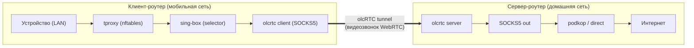
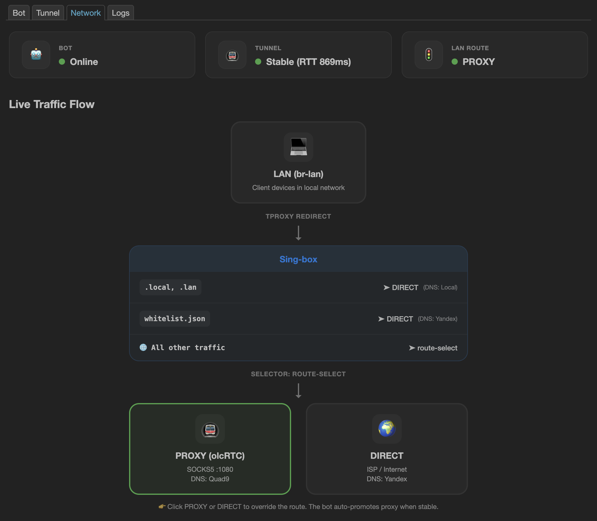

# dial-up!

**Домашний интернет на даче.**

**dial-up!** позволяет легко и удобно пользоваться мобильным интернетом в России. 
С помощью `olcrtc` он пробивает зашифрованный WebRTC-туннель между мобильным и домашним роутерами на базе OpenWrt, позволяя централизованно управлять правилами маршрутизации трафика. 
Вы просто отправляете ВК-боту ссылку на видеозвонок, и получаете привычный домашний доступ к интернету с любого устройства.

> [!WARNING]
> Проект разработан для личных нужд и предназначен только для исследований. Возможны ошибки, нестабильная работа и неудовлетворенность пользователя. 
> Протестировано на GLi.Net MT6000 (сервер), Cudy TR3000 (клиент, tethering)



---

## Системные требования
- Требуется OpenWrt 24.10+.
- Необходимо как минимум 22 Мб свободного места на клиентском роутере и 16Мб на серверном.

## Как это работает

1. На домашнем роутере (сервер) и мобильном роутере (клиент) установлен dial-up!.
2. Вы создаёте комнату видеозвонка (Яндекс Телемост или WBStream).
3. Отправляете ссылку на комнату VK-боту — бот на обоих роутерах получает её, настраивает olcRTC и поднимает туннель.
4. Весь трафик с клиентского роутера идёт через домашний: `LAN → tproxy → sing-box → olcrtc client → [tunnel] → olcrtc server → SOCKS5 out → podkop → www`.

## Что входит в комплект

- **olcRTC-туннель**: зашифрованный TCP-over-WebRTC, маскирующийся под видеозвонок
- **VK-бот**: управление туннелем через ВКонтакте — запуск, остановка, статус, переключение маршрутов
- **sing-box + tproxy**: прозрачный прокси на клиентском роутере, список ресурсов белого списка для быстрого прямого доступа к российским сервисам
- **LuCI-панель**: веб-интерфейс на роутере — статус, управление, настройки, логи, диагностика
- **Автоматизация**: crash recovery, автопереключение маршрутов, сохранение провайдера между перезагрузками

> [!WARNING]
> Ваш конфиг `sing-box` на клиентском роутере БУДЕТ ПЕРЕЗАПИСАН.

---

## Быстрая установка (на роутере, без компьютера)

```bash
sh -c "$(wget -qO- https://raw.githubusercontent.com/vongostev/OlcRTC-OpenWRT-VK-Bot/main/install.sh)"
```

Скрипт интерактивно запросит `VK_TOKEN` и `OLCRTC_KEY`, определит роль (клиент/сервер), установит бинарники, sing-box, tproxy-правила, LuCI-панель и запустит сервис.

## Установка с компьютера (make deploy)

### Подготовка

Сгенерируйте общий ключ шифрования (один на пару роутеров):

```bash
openssl rand -hex 32
```

[Настройте VK-бота](https://github.com/kulikov0/whitelist-bypass/blob/main/docs/SETUP.md#%D0%B1%D0%BE%D1%82-vk) и получите токен.

### Деплой сервера

Подключите домашний роутер к компьютеру:

```bash
make deploy server root@192.168.2.1 \
  VK_TOKEN="токен бота" \
  OLCRTC_KEY="ключ" \
  ALLOWED_USER_IDS="123,456"
```

> Также токен бота, ключ тоннеля и разрешенных пользователей можно настроить позже через LuCI

### Деплой клиента

Подключите мобильный роутер:

```bash
make deploy client root@192.168.3.1 \
  VK_TOKEN="токен бота" \
  OLCRTC_KEY="ключ" \
  ALLOWED_USER_IDS="123,456"
```

На клиенте автоматически установятся sing-box, tproxy-правила и whitelist.

> По умолчанию: тип `client`, хост `root@192.168.1.1`.

### Деплой сервера с upstream SOCKS5 (podkop)

Если на серверном роутере трафик должен уходить через podkop mixed_proxy или другой SOCKS5-прокси:

```bash
make deploy server root@192.168.2.1 \
  VK_TOKEN="токен бота" \
  OLCRTC_KEY="ключ" \
  SOCKS_PROXY_ADDR="127.0.0.1" \
  SOCKS_PROXY_PORT="1080"
```

> podkop не принимает соединения с localhost, так что для него надо задавать SOCKS_PROXY_ADDR="192.168.2.1"

### Удаление

```bash
make remove root@192.168.0.1
```

Удаляет бинарники, init-скрипт, tproxy-правила, LuCI-приложение. Файл `/etc/dial-up.env` сохраняется.

---

## VK-бот

### Подключение к комнате

Отправьте боту ссылку, он автоматически распознает провайдера, настроит оба роутера и поднимет туннель.
Поддерживаемые форматы:

- `https://stream.wb.ru/room/123456`
- `wbstream://123456`
- `https://telemost.360.yandex.ru/j/123456`
- `https://telemost.yandex.ru/j/123456`

### Команды

Вызов клавиатуры: `/menu` или `/start`.

| Команда | Действие |
|---|---|
| Ссылка на комнату | Подключиться к видеозвонку и поднять туннель |
| `/s` / "Status" | Статус туннеля, пинг DNS, маршрут sing-box |
| `/n` / "Stop" | Остановить туннель и удалить провайдера |
| `/r` / "Restart" | Перезапустить туннель |
| `/m proxy` / "Proxy" | Переключить маршрут через туннель |
| `/m direct` / "Direct" | Переключить маршрут напрямую |

### Автоматика

- При стабильном соединении (>30 сек) маршрут автоматически переключается на `proxy` (в туннель).
- При обрыве туннеля — возврат на `direct` (интернет мимо туннеля).
- При ошибке авторизации — провайдер удаляется, бот сообщает об ошибке.
- Crash recovery с экспоненциальным backoff.

> Через luci можно принудительно поставить маршрут `direct` при проблемах с туннелем.

---

## Маршрутизация трафика (клиент)

sing-box работает как постоянный сервис с outbound-селектором `route-select`:

- **`direct`** (по умолчанию) — трафик идёт напрямую через оператора
- **`proxy`** — трафик идёт через olcRTC-туннель

Правила tproxy активны всегда. Безопасность обеспечивается состоянием селектора: даже если туннель упал, трафик автоматически возвращается на `direct`.
Белый список гарантирует прямой доступ к российским сервисам (Яндекс, ВК, Госуслуги, банки и т.д.) без туннеля.

---

## LuCI-панель

Веб-интерфейс доступен на роутере: **Services → dial-up!**

| Вкладка | Возможности                                                                                                 |
|---|-------------------------------------------------------------------------------------------------------------|
| **Bot** | Роль (клиент/сервер), VK-токен, разрешённые пользователи, расширенные настройки (пути, backoff, DEBUG)       |
| **Tunnel** | Подключение по URL провайдера, статус/метрики/диагностика туннеля, ключ шифрования (OLCRTC_KEY)             |
| **Network** | **Клиент:** визуальная схема трафика, переключение маршрута (proxy/direct), whitelist-домены, диагностика tproxy/sing-box. **Сервер:** upstream SOCKS5 с тестом |
| **Logs** | Логи dial-up, olcrtc, sing-box с фильтрацией по источнику, поиском, автообновлением и скачиванием           |



---

## Переменные окружения

Хранятся в `/etc/dial-up.env`.

| Ключ | Умолчание | Описание |
|---|---|---|
| `VK_TOKEN` | *обязательно* | Токен ВКонтакте |
| `OLCRTC_KEY` | *обязательно* | Общий ключ шифрования (одинаковый на сервере и клиенте) |
| `IS_CLIENT` | `true` | `true` — клиент, `false` — сервер |
| `ALLOWED_USER_IDS` | | VK ID через запятую (пусто = все) |
| `STATUS_PORT` | `9091` | Порт HTTP-эндпоинта статуса (loopback) |
| `SOCKS_PROXY_ADDR` | | Upstream SOCKS5 адрес (только сервер) |
| `SOCKS_PROXY_PORT` | | Upstream SOCKS5 порт (только сервер) |
| `SOCKS_PROXY_USER` | | Upstream SOCKS5 логин |
| `SOCKS_PROXY_PASS` | | Upstream SOCKS5 пароль |
| `OLCRTC_EXE` | `/etc/olcrtc-linux-arm64` | Путь до бинарника olcrtc |
| `DATA_DIR` | `data` | Рабочая директория |
| `LAST_PROVIDER_FILE` | `last_provider.json` | Файл сохранения провайдера |
| `SLEEP_ON_ERROR` | `5` | Задержка перед рестартом при ошибке (сек) |
| `DEBUG` | `false` | Debug-логи |

---

## Управление сервисом

```bash
# Статус
/etc/init.d/dial-up status

# Перезапуск
/etc/init.d/dial-up restart

# Логи
logread -e dial-up

# Проверить tproxy
nft list chain inet fw4 singbox_tproxy

# Проверить sing-box
/etc/init.d/sing-box status
```

---

## Ссылки

- [OlcRTC](https://github.com/openlibrecommunity/olcrtc)
- [Настройка VK-бота](https://github.com/kulikov0/whitelist-bypass/blob/main/docs/SETUP.md#%D0%B1%D0%BE%D1%82-vk)
- [Идейный вдохновитель - proxy_bot на Python](https://github.com/ivanovrvl/proxy_bot.git)
- [Список ресурсов с гарантированным доступом](https://github.com/hxehex/russia-mobile-internet-whitelist/blob/main/whitelist.txt)
- [Архитектура проекта](ARCHITECTURE.md)
